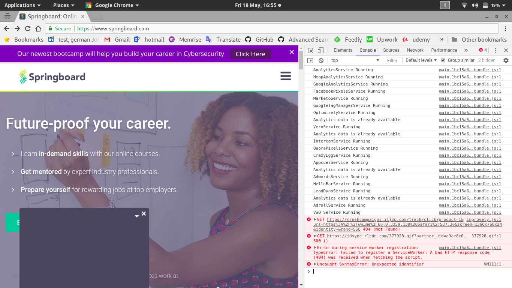

# Test Report
Avi Mehenwal avi.mehenwal@gmai.com
:toc:

### [Homepage] 4 console error reported <<toc>>
[width="50%"]
|===
| priority | low
| severity | low
| browser | chrome: 66.0.3359.139
| Environment | Linux: 4.16.8-1-ARCH
|===

#### Steps To Reproduce

. Open https://www.springboard.com/ in chrome browser
. Open chrome developer tools (CTRL+SHIFT+I or right click then Inspect)
. Click on *Console* tab and observe console errors

[%header,cols=2*]
|===
| Expected |Actual
| Browser should not throw any console error. Unless 3rd party and low impact
| 4 console error were observed with 1 being *Syntax Error*
|===

---

### [Workshop page] Using same email to register multiple times gives same alert message <<toc>>

[width="50%"]
|===
| priority | low
| severity | low
| browser | chrome: 66.0.3359.139
| Environment | Linux: 4.16.8-1-ARCH
|===

#### Steps To Reproduce

. Open https://www.springboard.com/ in chrome browser
. Click on Menubar > Cybersecurity Career Track
. When on page https://workshops.springboard.com/cyber-security-career-track/
. Enter same dummy / wrong email multiple times

[%header,cols=2*]
|===
| Expected |Actual
| Same message should not be presented if already registered with an email id. Instead more appropriate message like Email already registered with us` should be used.
| same message appears on screen despite entering the same email ID multiple times. This may make some users believe they were NOT registered previously but now they are.
|===

video::media/springboard_bug_email_repeatable-2018-05-18_18.22.16.mp4[video]
